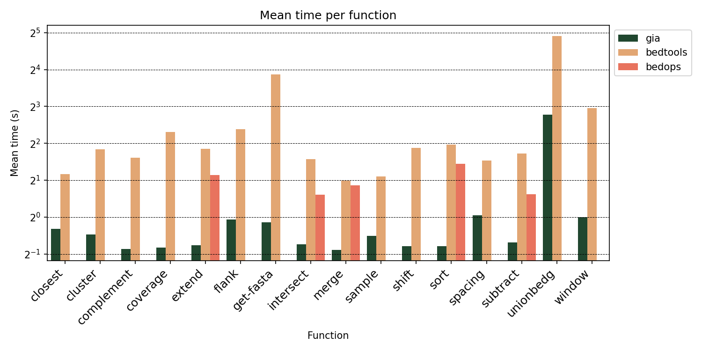
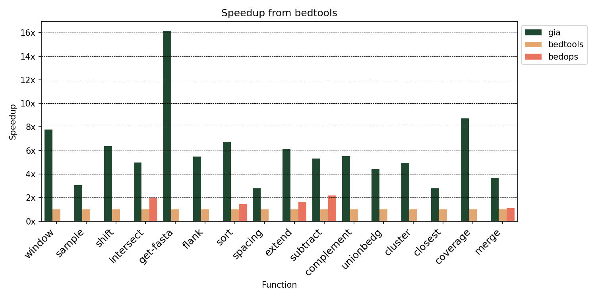

# interval_benchmark
Benchmarking suite for gia, bedtools, and bedops

## General Notes

For operations with a single input then BED file used is 5M intervals.
For operations with dual input both BED files are each 2M intervals.

See individual operation details in their respective calls in `imports/*.just` if
you are unsure of what is being used.

### Version Details
``` text
gia v0.2.20
bedtools v2.31.0
bedops 2.4.41(typical)
Device: MacBook Pro, M2 Max, 32gb, macOS 14.4.1
```

## Figures

### Global Operations




### BAM Operations

> *Note:* `gia_mt` in this case refers to 12 core multithreaded. `gia` is single threaded by default.


### Stranded Operations

> *Note:* Speedup is calculated using `bedtools-stranded` as baseline.


## Reproducing Benchmarks

All timing is calculated using [`hyperfine`](https://github.com/sharkdp/hyperfine)
and the command running is handled by [`just`](https://github.com/casey/just).

Reproducing this analysis:

### Getting all the necessary tools in $PATH
```bash
# You will need hyperfine, just, and gia in your path
cargo install hyperfine just gia

# You will need to install bedtools, bedops, and samtools
# I'll leave this up to you to figure out because it's
# device specific
brew install samtools bedtools bedops
```

### Setting up FASTA operations

We'll need to download the Ensembl reference fasta for testing.
I like to use [`ggetrs`](https://github.com/noamteyssier/ggetrs) for things like that.

```bash
# You will need to get the human genome reference fasta, however you want,
# but I like to use ggetrs for this.
cd data/
ggetrs ref -Dd dna

# Then you'll need to make a BGZIP version of this fasta
bgzip -c Homo_sapiens.GRCh38.dna.primary_assembly.fa > Homo_sapiens.GRCh38.dna.primary_assembly.fa.gz

# Create indices for both
samtools faidx *.fa
samtools faidx *.gz

# Step back up to the root directory
cd ../

```

### Creating all the BED files

Now can we generate all the random BED files used in the tests.

```bash
# Generate all input files
just gen
```

### Run benchmarking

Then you're ready to benchmark:

```bash
# Benchmarks all functions
just benchmark

# Benchmarks all stranded functions
just benchmark_stranded
```